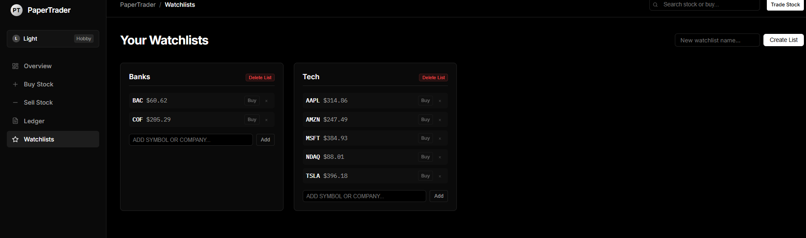
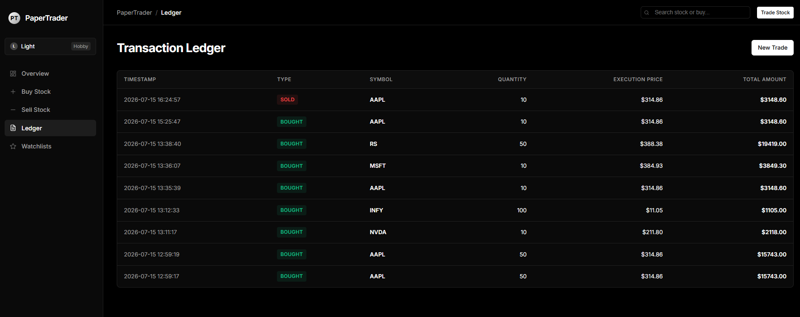

# PaperTrader

A full-stack paper trading platform built with **Python**, **Flask**, and **SQLite** that enables users to simulate stock trading using live market data without risking real capital.


---

## Overview

PaperTrader is a virtual stock trading application designed to replicate the workflow of a real brokerage platform. Users can register, manage a virtual portfolio, execute simulated trades using live market prices, maintain watchlists, and review their transaction history.

---

## Features

- User authentication with secure password hashing
- Paper trading using virtual funds
- Live stock prices via Finnhub API
- Company symbol lookup using the SEC Company Ticker Database
- Portfolio management and valuation
- Buy and sell stock simulation
- Transaction history
- Custom watchlists
- Autocomplete stock search
- SQLite database persistence

---

## Application Screenshots

### Login


Secure user authentication with session management.

---

### Dashboard


The dashboard provides:

- Portfolio value
- Cash balance
- Holdings value
- Unrealized profit and loss
- Current holdings
- Quick trading interface
- Popular stocks

---

### Watchlists



Users can organize stocks into custom watchlists and access market data with a single click.

Features include:

- Multiple watchlists
- Add and remove stocks
- Stock search
- Quick buy actions

---

### Transaction History



Every executed trade is recorded with:

- Transaction type
- Stock symbol
- Quantity
- Execution price
- Timestamp

---

## System Architecture


PaperTrader follows a layered architecture.

- **Presentation Layer** – Flask routes and HTML templates
- **Repository Layer** – Business logic and data access
- **Database Layer** – SQLite persistence
- **External Services**
  - Finnhub API for live market prices
  - SEC Company Ticker Database for symbol lookup

---

## Conceptual Class Diagram


The class diagram illustrates the relationships between the primary domain models:

- User
- Portfolio
- Position
- Transaction
- WatchList
- Trading Engine
- Market Data Provider

---

## Entity Relationship Diagram


Database schema consisting of:

- Users
- Holdings
- Transactions
- Watchlists
- Watchlist Stocks

---

## Technology Stack

| Category | Technology |
|-----------|------------|
| Programming Language | Python |
| Web Framework | Flask |
| Database | SQLite |
| Authentication | Werkzeug |
| Market Data | Finnhub API |
| Symbol Lookup | SEC Company Ticker Database |
| Frontend | HTML, CSS, JavaScript |
| Version Control | Git & GitHub |

---

## Project Structure

```text
PaperTrader/
│
├── app.py
├── schema.sql
├── requirements.txt
├── README.md
│
├── models/
├── repositories/
├── database/
├── routes/
├── services/
├── templates/
├── static/
├── tests/
├── docs/
└── data/
```

---

## Installation

### Clone the repository

```bash
git clone https://github.com/<your-username>/PaperTrader.git
cd PaperTrader
```

### Create a virtual environment

**Windows**

```bash
python -m venv .venv
.venv\Scripts\activate
```

**Linux / macOS**

```bash
python3 -m venv .venv
source .venv/bin/activate
```

### Install dependencies

```bash
pip install -r requirements.txt
```

### Configure environment variables

Create a `.env` file in the project root.

```env
FINNHUB_API_KEY=YOUR_API_KEY
SEC_CONTACT_EMAIL=your_email@example.com
SECRET_KEY=your_secret_key
```

### Initialize the database

```bash
python init_db.py
```

### Run the application

```bash
python app.py
```

Open the application in your browser:

```
http://127.0.0.1:5000
```

---

## Future Enhancements

- Email verification
- Password reset
- Portfolio analytics
- Interactive price charts
- Stop-loss and limit orders
- News integration
- REST API
- PostgreSQL support
- Docker deployment
- Cloud deployment (AWS or Azure)

---

## License

This project is licensed under the **MIT License**.

See the [LICENSE](LICENSE) file for additional information.

---

## Author

**Arjun Mohan Saxena**

B.Tech, Indian Institute of Technology Mandi