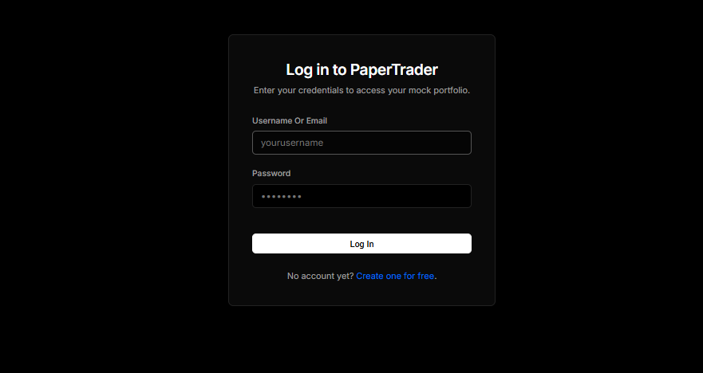
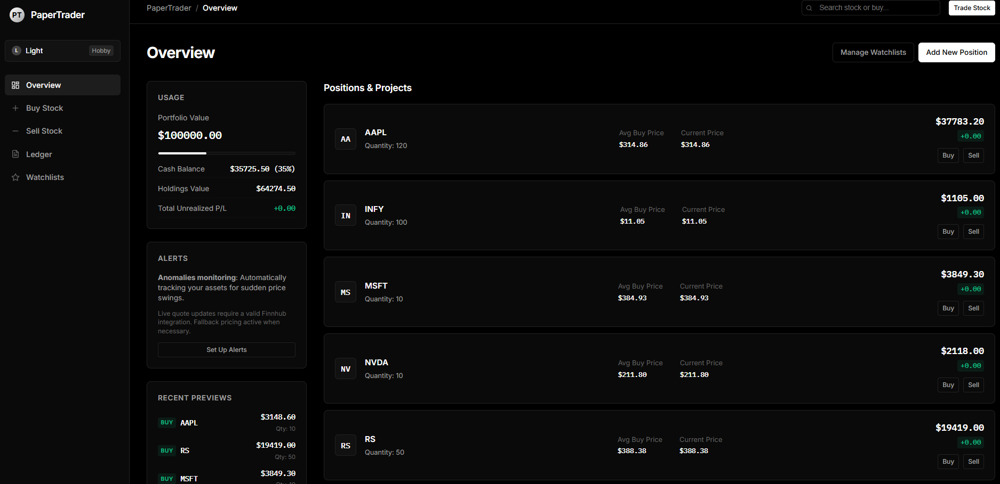
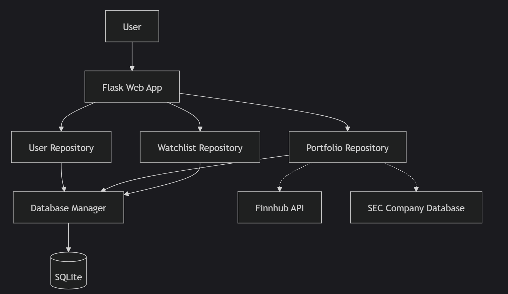
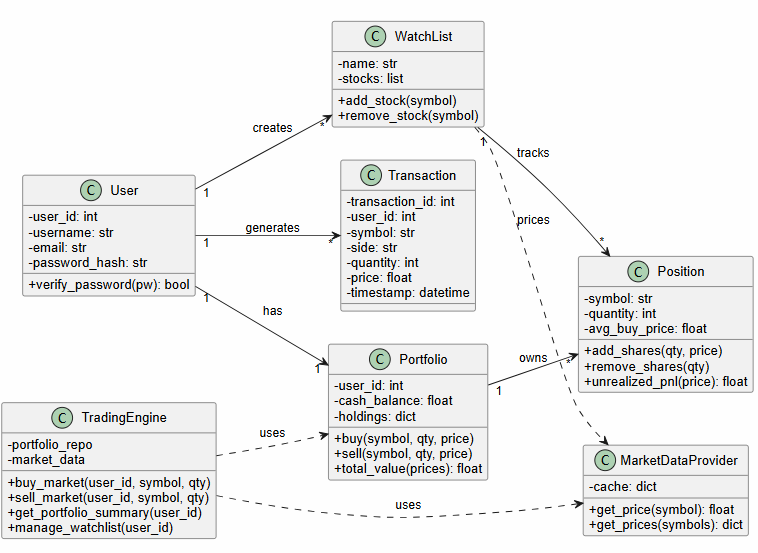
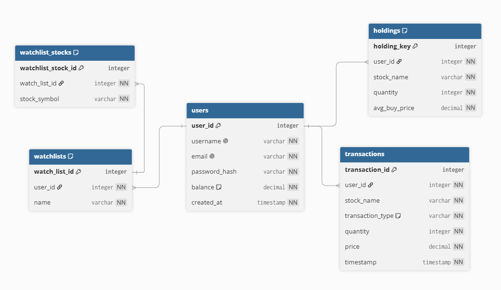

# 📈 PaperTrader

> A full-stack paper trading platform built with **Python**, **Flask**, and **SQLite** that allows users to simulate stock trading using real-time market prices without risking real money.


---

# ✨ Features

- 🔐 Secure User Authentication
- 📈 Buy & Sell Stocks
- 💰 Virtual Portfolio Management
- 📊 Real-Time Portfolio Valuation
- ⭐ Custom Watchlists
- 🔍 Autocomplete Stock Search
- 📜 Transaction History
- ⚡ Live Stock Prices (Finnhub API)
- 🏛 SEC Company Database Integration
- 💾 SQLite Database

---

# 📸 Application Screenshots

## 🔑 Login



Secure login with password hashing and session-based authentication.

---

## 📊 Dashboard



The dashboard provides a complete overview of the portfolio including:

- Portfolio Value
- Cash Balance
- Holdings Value
- Unrealized Profit/Loss
- Current Holdings
- Quick Buy & Sell
- Popular Stocks

---

## ⭐ Watchlists


Create and manage multiple watchlists with quick access to market prices.

Features:

- Multiple Watchlists
- Add / Remove Stocks
- Live Search
- Quick Buy

---

## 📜 Transaction History


A complete ledger of all executed paper trades including:

- Buy Orders
- Sell Orders
- Price
- Quantity
- Timestamp

---

# 🏗️ System Architecture



The application follows a layered architecture.

- **Presentation Layer** – Flask routes and HTML templates
- **Repository Layer** – Handles business logic and database operations
- **Database Layer** – SQLite with normalized schema
- **External Services**
  - Finnhub API (Live Market Prices)
  - SEC Company Database (Company Symbol Lookup)

---

# 📘 Conceptual Class Diagram



The class diagram illustrates the relationships between the core domain models including:

- User
- Portfolio
- Position
- Transaction
- WatchList
- Trading Engine
- Market Data Provider

---

# 🗄️ Entity Relationship Diagram



Database Tables:

- Users
- Holdings
- Transactions
- Watchlists
- Watchlist Stocks

---

# 🔄 Buy Stock Workflow


Sequence Overview:

1. User enters company name and quantity.
2. Application retrieves the stock symbol from the SEC Company Database.
3. Live stock price is fetched from Finnhub.
4. User balance is validated.
5. Holdings and transactions are updated.
6. Portfolio summary is refreshed.

---

# 🛠 Tech Stack

| Category | Technology |
|-----------|------------|
| Backend | Python |
| Framework | Flask |
| Database | SQLite |
| Authentication | Werkzeug |
| Market Data | Finnhub API |
| Company Search | SEC Company Database |
| Frontend | HTML, CSS, JavaScript |
| Version Control | Git & GitHub |

---

# 📂 Project Structure

```text
PaperTrader/
│
├── app.py
├── schema.sql
├── requirements.txt
├── README.md
│
├── models/
├── repositories/
├── database/
├── routes/
├── templates/
├── static/
├── utils/
├── data/
└── docs/
    ├── architecture.png
    ├── class_diagram.png
    ├── er_diagram.png
    ├── buy_sequence.png
    └── screenshots/
        ├── login.png
        ├── dashboard.png
        ├── watchlists.png
        └── transactions.png
```

---

# ⚙️ Installation

## Clone the repository

```bash
git clone https://github.com/<your-username>/PaperTrader.git
cd PaperTrader
```

## Create a Virtual Environment

### Windows

```bash
python -m venv .venv
.venv\Scripts\activate
```

### Linux / macOS

```bash
python3 -m venv .venv
source .venv/bin/activate
```

## Install Dependencies

```bash
pip install -r requirements.txt
```

## Configure Environment Variables

Create a `.env` file in the project root.

```env
FINNHUB_API_KEY=YOUR_API_KEY
SEC_CONTACT_EMAIL=your_email@example.com
SECRET_KEY=your_secret_key
```

## Initialize the Database

```bash
python init_db.py
```

## Run the Application

```bash
python app.py
```

Open your browser and visit:

```
http://127.0.0.1:5000
```

---

# 🚀 Future Improvements

- Email Verification
- Password Reset
- Limit & Stop Orders
- Portfolio Analytics
- Candlestick Charts
- Stock News Integration
- REST API
- Docker Support
- PostgreSQL Migration
- Cloud Deployment (AWS / Azure)

---

# 📄 License

This project is intended for educational purposes only and does **not** execute real financial trades.

---

# 👨‍💻 Author

**Arjun Mohan Saxena**

B.Tech, Indian Institute of Technology Mandi